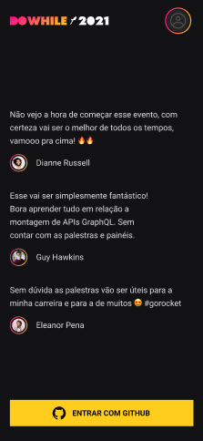
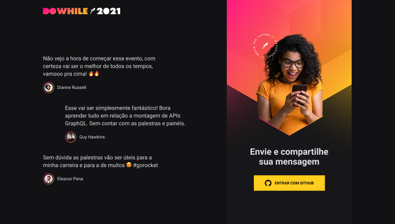

<h1 align="center">
  
</h1>

<p align="center">
  <a href="#description">Description</a>&nbsp;&nbsp;&nbsp;|&nbsp;&nbsp;&nbsp;
  <a href="#requirements">Requirements</a>&nbsp;&nbsp;&nbsp;|&nbsp;&nbsp;&nbsp;
  <a href="#technologies">Technologies</a>&nbsp;&nbsp;&nbsp;|&nbsp;&nbsp;&nbsp;
  <a href="#layout">Layout</a>&nbsp;&nbsp;&nbsp;|&nbsp;&nbsp;&nbsp;
  <a href="#usage">Usage</a>&nbsp;&nbsp;&nbsp;|&nbsp;&nbsp;&nbsp;
  <a href="#demonstration">Demonstration</a>
</p>
<br />
<p align="center">
  
  
  
  
  
  
  
</p>

<p align="center">
  <a href="https://github.com/Lissone/nlw-heat-impulse/issues">Report bug</a>
  ·
  <a href="https://github.com/Lissone/nlw-heat-impulse/issues">Request feature</a>
</p>

<br />

## Description

Website and messaging app to share with the community your expectations for the DoWhile 2021 event, organized by Rocketseat. Developed at NLW Heat on the 2021 impulse trail, developed by Dani Leão on October 17th to 24th, 2021.

## Requirements

* [Yarn](https://yarnpkg.com/)
* [Nodejs](https://nodejs.org/en/)

## Technologies

### Backend (Api)
* Nodejs
* Typescript
* Express
* Prisma
* Sqlite
* Socket.io

### Web
* Vite
* React
* Typescript
* Sass
* Socket.io
* ESLint (Airbnb config)

### Mobile
* Expo
* Typescript
* StyleSheet
* AsyncStorage
* Expo Auth Session
* Moti
* Socket.io

## Layout

You can view the project layout via this <a href="https://www.figma.com/file/7HXNlFooVG8OvwJCIAEsRb/%5BNLW-Heat---Mission%3A-Impulse%5D-DoWhile2021?node-id=2%3A3" target="_blank">link</a>.

## Usage

You can use this project as a template for another one, or clone it on your pc using the command:

```bash
git clone https://github.com/Lissone/nlw-heat-impulse.git
cd nlw-heat-impulse
```

Install dependencies using:
```bash
yarn
#or
npm run

# .\packages\mobile
yarn
#or
npm run
```

First of all, you must create an OAuth application for each front-end project in github for authentication. Follow the github <a href="https://docs.github.com/en/developers/apps/building-oauth-apps/creating-an-oauth-app" target="_blank">documentation</a> and add this data in the fields:

```bash
# WEB APPLICATION
Application name = NLW Heat Impulse (Web)
Homepage URL = http://localhost:5000
Authorization callback URL = http://localhost:3000

# MOBILE APPLICATION
Application name = NLW Heat Impulse (App)
Homepage URL = https://auth.expo.io/(your_expo_id)/nlwheatmobile
Authorization callback URL = https://auth.expo.io/(your_expo_id)/nlwheatmobile
```

Now you can get the GITHUB_CLIENT_ID and GITHUB_CLIENT_SECRET of both applications.

Need to add environment variables to projects:

```bash
# .\packages\api\.env

# DEFAULT
PORT=5000

# GITHUB OAUTH
# You can only choose one project to authenticate with github
GITHUB_CLIENT_ID=
GITHUB_CLIENT_SECRET=

# JWT
JWT_SECRET= #Anything
```

```bash
# .\packages\web\.env.local

# DEFAULT
VITE_BASE_URL_API=http://localhost:5000

# GITHUB OAUTH
VITE_GITHUB_CLIENT_ID=
```

```bash
# .\packages\mobile\.env

# DEFAULT
BASE_URL_API=http://(your_machine_ip_address):5000

# GITHUB OAUTH
GITHUB_CLIENT_ID=
```

Run api:

```bash
# To create a migration with prisma:

cd .\packages\api\
yarn prisma migrate dev
```

```bash
yarn dev
#or
npm run dev
```

```bash
# To open prisma studio to manage and view your database:

yarn prisma studio
```

Run web:
```bash
cd .\packages\web\
yarn dev
#or
npm run dev
```

Run mobile:
```bash
cd .\packages\mobile\
yarn start
#or
npm run start
#or
expo start
```

## Demonstration




## License

Distributed under the MIT License. See `LICENSE` for more information.

<h4 align="center">
  Made with ❤️ by <a href="https://github.com/Lissone" target="_blank">Lissone</a>
</h4>

<hr />